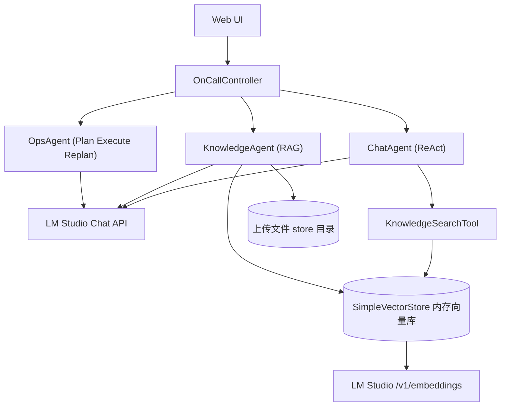

# OnCall Agent

基于 **Spring Boot 3.5 + Spring AI** 的智能 OnCall 运维助手，对接本地 **LM Studio**，提供对话咨询、知识库 RAG 问答和告警故障排查三类能力。


## 功能概览

| 模块   | Agent 模式            | 说明                     |
|------|---------------------|------------------------|
| 智能对话 | ReAct               | 多轮对话 + 工具调用，可按需检索知识库   |
| 知识库  | RAG                 | 上传 SOP 文档，分片向量化后语义检索问答 |
| 故障排查 | Plan-Execute-Replan | 根据告警信息自动规划排查步骤并生成报告    |

内置 Web 界面：`http://localhost:8080`

## 架构



## 技术栈

- Java 21
- Spring Boot 3.5.5
- Spring AI 1.1.2（OpenAI 兼容 Chat + Embedding）
- LM Studio（本地 LLM / Embedding）
- SimpleVectorStore（内存向量库）
- Tika Document Reader（文档解析）

## 环境要求

1. **JDK 21**
2. **LM Studio**，并开启 Local Server（默认 `http://127.0.0.1:1234`）
3. 在 LM Studio 中加载以下模型：
   - **Chat 模型**（默认 `qwen/qwen3.5-2b`）
   - **Embedding 模型**（默认 `text-embedding-nomic-embed-text-v1.5`）

## 快速开始

```bash
git clone https://github.com/de-luce/OnCall_Agent.git
cd OnCall_Agent

# 可选：环境变量
export LOCAL_LLM_MODEL=qwen/qwen3.5-2b
export EMBEDDING_MODEL=text-embedding-nomic-embed-text-v1.5
export LM_API_TOKEN=your-token   # LM Studio 启用鉴权时设置

./mvnw spring-boot:run
```

浏览器访问 [http://localhost:8080](http://localhost:8080)

### 运行测试

```bash
./mvnw clean test
```

## 配置说明

主要配置见 `src/main/resources/application.yml`：

```yaml
spring:
  ai:
    openai:
      base-url: http://127.0.0.1:1234
      chat:
        options:
          model: qwen/qwen3.5-2b
      embedding:
        options:
          model: text-embedding-nomic-embed-text-v1.5

oncall:
  upload:
    storage-dir: src/main/resources/store
```

### 环境变量

| 变量                   | 说明                  | 默认值                                    |
|----------------------|---------------------|----------------------------------------|
| `LOCAL_LLM_BASE_URL` | Chat API 地址         | `http://127.0.0.1:1234`                |
| `LOCAL_LLM_MODEL`    | Chat 模型名            | `qwen/qwen3.5-2b`                      |
| `EMBEDDING_MODEL`    | Embedding 模型名       | `text-embedding-nomic-embed-text-v1.5` |
| `LM_API_TOKEN`       | LM Studio API Token | `lm-studio`                            |
| `ONCALL_STORE_DIR`   | 上传文件目录              | `src/main/resources/store`             |

> **LM Studio OpenAI 兼容**：Chat 与 Embedding 均通过同一 `base-url` 访问 LM Studio，分别对应 `/v1/chat/completions` 与 `/v1/embeddings`。详见 [LM Studio OpenAI 兼容文档](https://lmstudio.ai/docs/developer/openai-compat)。

## API 接口

| 方法     | 路径                        | 说明           |
|--------|---------------------------|--------------|
| `POST` | `/api/chat`               | 智能对话（同步）     |
| `POST` | `/api/chat_stream`        | 智能对话（SSE 流式） |
| `POST` | `/api/upload_file`        | 上传知识库文档      |
| `GET`  | `/api/knowledge/keywords` | 获取已入库文档与关键词  |
| `POST` | `/api/knowledge/chat`     | 知识库 RAG 问答   |
| `POST` | `/api/ai_ops`             | 告警故障排查       |
| `GET`  | `/api/health`             | 健康检查         |

### 请求示例

**智能对话**

```bash
curl -X POST http://localhost:8080/api/chat \
  -H "Content-Type: application/json" \
  -d '{"message": "连接池耗尽怎么排查？", "sessionId": "demo-001"}'
```

**上传文档**

```bash
curl -X POST http://localhost:8080/api/upload_file \
  -F "file=@/path/to/sop.pdf"
```

**知识库问答**

```bash
curl -X POST http://localhost:8080/api/knowledge/chat \
  -H "Content-Type: application/json" \
  -d '{"message": "Redis 内存溢出如何处理？"}'
```

**故障排查**

```bash
curl -X POST http://localhost:8080/api/ai_ops \
  -H "Content-Type: application/json" \
  -d '{"serviceName": "payment-service", "alertMessage": "连接池耗尽，P99 延迟 2800ms"}'
```

## 项目结构

```
src/main/java/com/deluce/oncall/
├── agent/           # ChatAgent / KnowledgeAgent / OpsAgent
├── config/          # AI、Embedding、RAG 配置
├── controller/      # REST API
├── dto/             # 请求/响应对象
├── rag/             # 文档加载、分片、索引、检索
├── service/         # 业务编排
├── tool/            # Agent 工具（日志、指标、知识检索等）
└── exception/       # 全局异常处理

src/main/resources/
├── application.yml
├── static/          # Web 前端
└── store/           # 上传文件存储目录
```

## 数据存储说明

| 数据         | 存储位置                        | 重启后             |
|------------|-----------------------------|-----------------|
| 上传的原始文件    | `src/main/resources/store/` | 保留              |
| 文档分片 + 向量  | JVM 内存（SimpleVectorStore）   | 丢失，需重新上传        |
| 关键词 / 文档列表 | 启动时扫描 store 目录恢复            | 文件名保留，分片数需重新向量化 |

## 常见问题

**发送消息无响应**

- 确认 LM Studio Local Server 已启动
- 确认 Chat 模型已加载
- 查看后端日志是否有 LLM 调用记录

**上传文档报 `No models loaded`**

- 需要在 LM Studio 中加载 Embedding 模型
- 确认 `spring.ai.openai.embedding.options.model` 与 LM Studio 中模型名一致

**重启后知识库问答搜不到内容**

- 向量库为内存存储，重启后需重新上传文档完成向量化

## License

MIT
